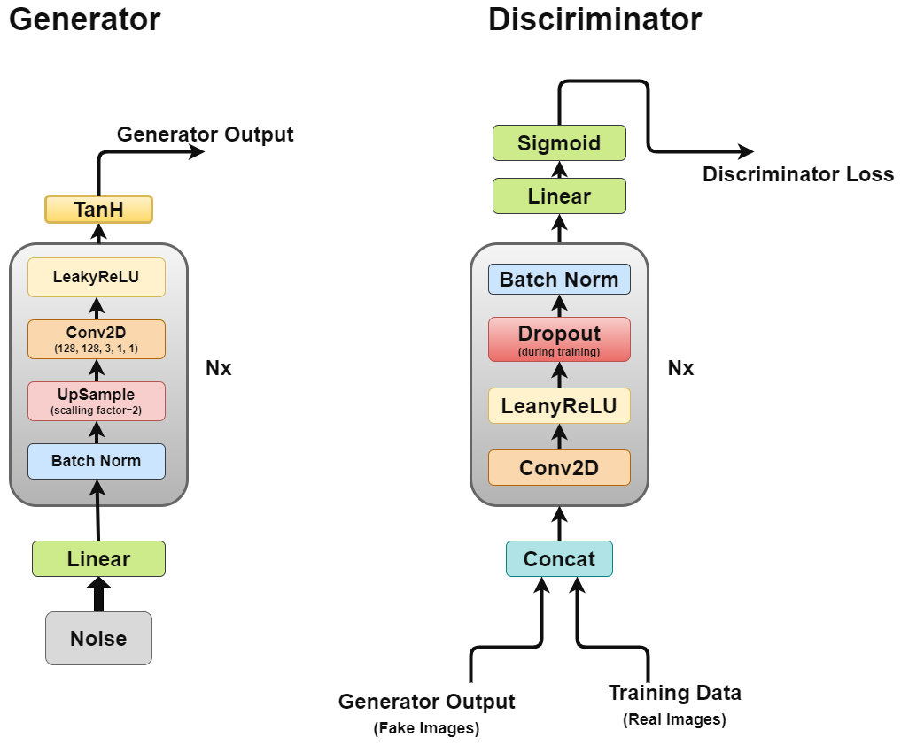

# Understanding Deep Convolutional GAN

</img>

In 2014 Ian Goodfellow et al. proposed a new approach for estimation of generative models through adversarial process. It involved training two separate models at the same time, a Generator model which attempts to model the data distribution and ad Discriminator which attempts to classify the input as either training data or fake data by generator.

The paper sets a very important milestone in modern machine learning landscape, opening new avenues for unsupervised learning. Deep Convolutional GAN (Radford et al. 2015) continued building on this idea by applying the principles on a convolutional network to produce 2D images successfully.

## What is so cool about GAN
To understand the importance of GAN or DCGAN let’s look at what makes them so popular.

<ol>
    <li>As a large percentage of real-world data is unlabeled the unsupervised learning nature of GAN's make them ideal for such use cases. </li>
    <li>Generator and Discriminator act as very good feature extractor for uses cases with limited labelled data or generate additional data to improve secondary model training, as it can generate fake samples instead of using augmentations. </li>
    <li>GAN's provide an alternative to maximum likelihood techniques. Their adversarial learning process and non-heuristic cost function makes them very attractive to reinforcement learning. </li>
    <li>The research around GAN has been very attractive and the results have been source of widespread debate on the impact ML/DL. For example, Deepfake, one of the applications of GAN which can overlay people's face on a target person, has been very controversial in nature as it has the potential to be used for nefarious purposes. </li>
    <li>The last but the most important point being, it’s just so very cool to work with, and all the new research in the field has been mesmerizing. </li>
</ol>

## Architecture

Architecture of DCGAN</img>

As we discussed earlier, we will be working through DCGAN which attempts to implement the core ideas of GAN for a convolutional network which can generate realistic looking images.

DCGAN is made up of two separate models, a Generator (G) which attempts to model which takes a random noise vector as input and attempts learn data distributional to generate fake samples and a Discriminator (D) which takes training data (real samples) and generated data (fake samples) and tries to classify them, this struggle between the two models is what we call adversarial training process where one's loss is other's benefit.

## Generator

Generator is the one we are most interested in as it is the one generating fake images to try and fool the discriminator.

Now let’s look at the generator architecture in more detail.

<ol>
    <li>Linear layer: The noise vector is feed into a fully connected layer the output of which is then reshaped into a 4D tensor. </li>
    <li>Batch Normalization Layer: Stabilizes learning by normalizing inputs to zero mean and unit variance, this avoids training issues like vanishing or exploding gradient and allows the gradient to flow through the network. </li>
    <li>Up sample Layer: As per my interpretation of the paper, it mentions using up sampling and then applying simple convolutional layer on it rather than using a convolutional transpose layer to up sample. But I have seen some people use convolutional transpose, so make your own decision. </li>
    <li>2D Convolutional Layer: As we up sample the matrix, we pass it through a convolutional layer with stride of 1 and same padding to allow it to learn from its up sampled data</li>
    <li>ReLU Layer: Paper mentions using RelU instead of LeakyReLU for generator as it allowed the model to saturate quickly and cover color space of training distribution. </li>
    <li>TanH Activation: Paper suggests we use tanH activation function for generator output but does not go in detail as to why</li>
</ol>

Layers 2 to 5 make up the core generator block which can be repeated N times to get the desired output image shape.

## Discriminator

Now the discriminator is rather like an image classification network with a few minor tweaks, for example it does not use any pooling layer to down sample but a stride convolutional layer allowing it to learn its own down sampling.

Let’s look at the discriminator architecture in more detail.

<ol>
    <li>Concat Layer: The layer combines fake images real images in a single batch to feed the discriminator, but this can also be done separately for getting the generator loss only.</li>
    <li>Convolutional Layer: We use a stride convolution here which allows us to down sample the image and learn filters in a single pass. </li>
    <li>LeakyReLU: As the paper mentions it found LeakyReLU useful for discriminator compared to maxout function of original GAN paper, as it allows for easier training. </li>
    <li>Dropout: Used only for training, helps avoid overfitting. The model has a tendency to memorize real image data and training could collapse at that point as discriminator cannot be fooled by generator anymore</li>
    <li>Batch Normalization: Paper mention that it applies batch normalization at the end of every discriminator block except the first one. The reason mentioned by paper is that applying batch normalization over every layer cause sample oscillation and model instability. </li>
    <li>Linear: A fully connected layer which takes a reshaped vector from 2D batch normalization layer applied through. </li>
    <li>Sigmoid Activation: As we are dealing with binary classification for discriminator output making sigmoid the logical choice</li>
</ol>

Layers 2 to 5 make up the core discriminator block which can be repeated N times to make model more complex per training data.

## Adversarial Training

As we are training two models simultaneously it could be tricky and one of the known problems with GAN's in general is mode collapse we will discuss more on that later.

Paper suggests using Adam optimizer with learning rate of 0.0002, such a low learning rate suggests that GAN's tend to diverge very quickly. It also uses momentum of first order and second order with values of 0.5 and 0.999 to further accelerate training.

Initial model is initialized with normal weight distribution with zero mean and 0.02 standard deviation.

### Mode Collapse

Ideally, we would like our generator to produce a wide variety of outputs, for example if it generates a face, it should generate a new face for every random input. But if generator produces a plausible output good enough to fool discriminator it might keep producing the same output again and again.

Eventually generator over-optimizes for a single discriminator and rotates between a small set of outputs, such condition is called mode collapse.

Following approaches can be used to remedy such condition.

<ol>
    <li>Wasserstein loss: The Wasserstein loss alleviates mode collapse by letting you train the discriminator to optimality without worrying about vanishing gradients. If the discriminator doesn't get stuck in local minima, it learns to reject the outputs that the generator stabilizes on. So, the generator has to try something new. </li>
    <li>Unrolled GANs: Unrolled GANs use a generator loss function that incorporates not only the current discriminator's classifications, but also the outputs of future discriminator versions. So, the generator can't over-optimize for a single discriminator. </li>
</ol>

## Conclusion

GAN along with DCGAN is a milestone paper which has opened new avenues when it comes to unsupervised learning. The adversarial training approach provides a new way of training models which closely mimics real world learning process. It would very intresting to see how this area evolves.
